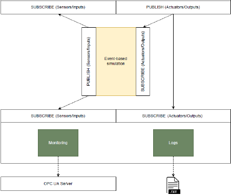

This is a deployment pack, which contains the event-based simulation of Station 1 of the VDMA OPC UA Demonstator as described in Chapter 5 of the [thesis](https://epub.jku.at/obvulihs/download/pdf/9183662).

The app simulates the execution of the demo by simulating the behavior of its IOs. The architecture is shown in the following figure:

From the folder, build the docker image:

`docker build -t forte .`

After the image is built, run the docker compose, which starts forte for 4 Station 1 devices: the robot, the gripper, the turntable, and the storage. The fifth forte-instance exposes an OPC UA server which allows to monitor I/Os. Start the docker-compose to run all the instances:

`docker-compose up`

The orchestration is run by the python script, install opcua package, if needed by running:

`pip install opcua`

Execute the orchestration app:

`python station1control.py`

The script logs the IO values' changes. The devices themselves also have the logs, saved in iolog.txt, which can be found in the corresponding docker images.

The 4diac-ide application is stored in the corresponding folder. The relevant application that is executed by the docker is VDMA_Station1_EmulatorApp. You can monitor the execution via IDE.
